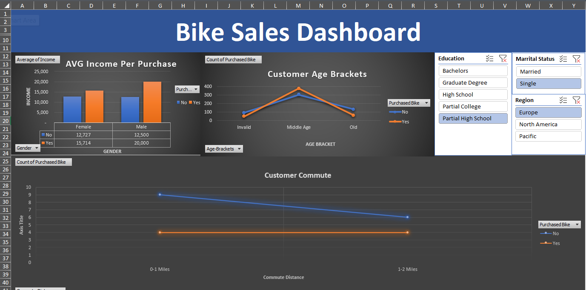
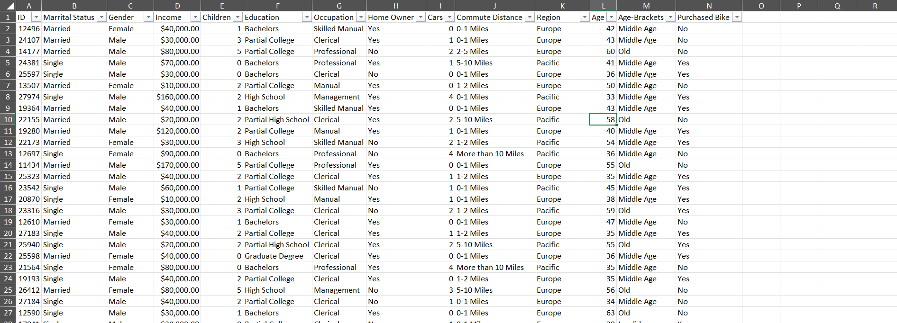

# 📌 Bike Buyers – Excel Dashboard  
📊 **Excel Project | Marketing Segmentation | Buyer Profiling | Income vs Purchase**  

    <b>Dashboard Overview</b>  
     
    

---

## 🔍 Project Overview  
This Excel dashboard analyzes the demographics and behavior of potential bike buyers. The goal is to uncover patterns in purchasing decisions based on income, age, gender, education, and commute distance.

### 🚀 Key Objectives  
✅ Identify **buyer demographics and commuting behavior**  
✅ Compare **purchasing trends by income and age bracket**  
✅ Segment market based on **commute distance and occupation**  
✅ Present findings in a clean, interactive Excel dashboard  

---

## 📂 Dataset & Structure  
🔹 **Data Source:** Simulated customer demographics dataset  
🔹 **Data Fields:**  
- ID, Marital Status, Gender, Income  
- Children, Education, Occupation, Cars  
- Home Owner, Commute Distance, Region  
- Age, Age Bracket, Purchased Bike (target)

🔹 **Excel File Structure:**  
- `Data` – Raw dataset used for pivot tables  
- `Bike Buyers` – Cleaned structure for visualization  
- `Pivot Table` – Breakdown by key attributes  
- `Overview` – Final dashboard with filters & visuals  

    <b>Pivot Table Analysis</b>  
     
    

---

## 📊 Excel Features & Techniques Used  
### 🔹 1. Dashboard Design  
✅ Clustered column and line charts  
✅ Dynamic slicers for **region**, **education**, **marital status**  
✅ Filters for **age brackets**, **purchase status**

### 🔹 2. Data Transformation  
✅ Derived **age brackets**  
✅ Combined filters by gender, income, and region  
✅ Cleaned fields for presentation-ready visuals

    <b>Data Source Sheet</b>  
     
    

    <b>Bike Buyers Sheet</b>  
     
    

---

## 📈 Key Insights & Business Value  
🔹 **Income Impact:** Buyers had higher average income – $20K vs $12.5K  
🔹 **Commute Factor:** Shorter commutes (0–1 miles) led to slightly higher purchases  
🔹 **Age Patterns:** Peak purchases in the 35–45 age range  
🔹 **Education & Region:** Partial college and Europe-region customers dominated purchases  
🔹 **Gender Behavior:** Males purchased slightly more bikes than females on average  

---

## 🛠️ How to Use the Dashboard  
1️⃣ Open `Bike_Buyers_Dashboard.xlsx` in Microsoft Excel  
2️⃣ Go to the **Overview** tab  
3️⃣ Use slicers (top right) to segment by region, education, or marital status  
4️⃣ Explore buyer patterns in age, commute, and income

👉 **[📥 Download Excel Dashboard (.xlsx)](https://github.com/shareef99997/Bike-Buyers-Excel-Dashboard/raw/main/Bike_Buyers_Dashboard.xlsx)**  

---

## 💡 Why This Project Stands Out  
✅ **Excel-Only Insight Tool** – No Python or Power BI used  
✅ **Business-Driven Questions** – Built with real use case in mind  
✅ **Clean UI** – Easy to read, slicer-powered, and interactive  
✅ **Visual Segmentation** – Income, age, and commute impact visualized  

---

## 👨‍💻 About Me  
Hi, I'm **Shareef Ali**, a passionate **Data Analyst** with expertise in **Power BI, SQL, and Python**.  

📬 **Let’s connect!** Check out my other projects or reach out:  

🔗 **[GitHub Portfolio](https://github.com/shareef99997)**  
🔗 **[LinkedIn](https://www.linkedin.com/in/shareef-ali/)**  
🔗 **[Personal Website](https://www.shareefdev.com)**  

📢 **If you found this project helpful, consider giving it a ⭐ on GitHub!** ⭐  
